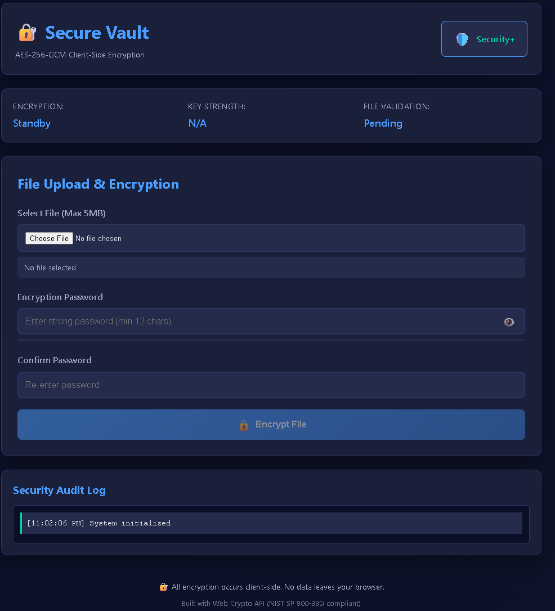
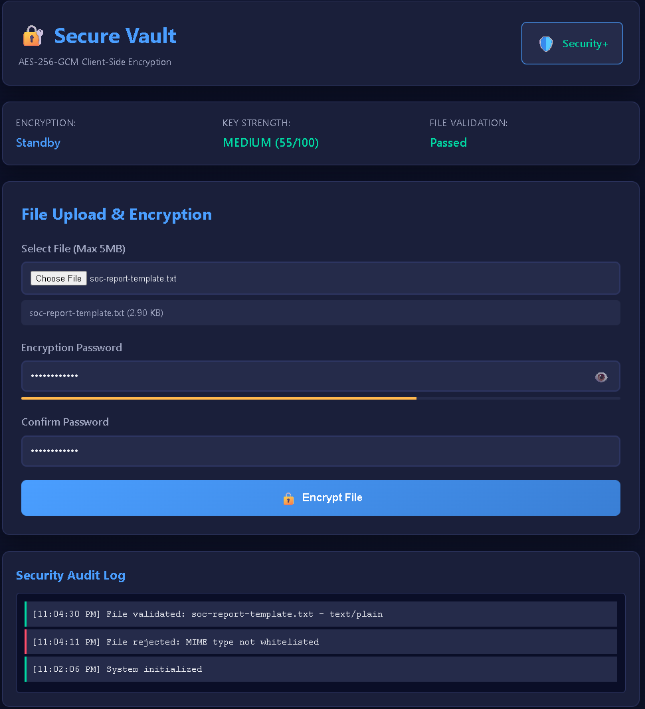
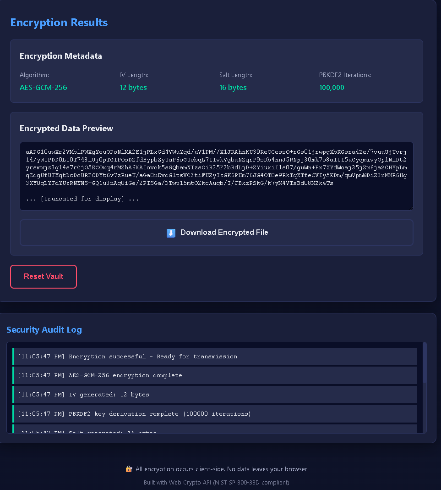

# Secure-Vault-Zero-Knowledge-Encryption
This project demonstrates professional-grade client-side encryption capabilities built with vanilla JavaScript and the Web Crypto API. The objective was to implement NIST-compliant cryptographic standards to ensure data privacy and integrity before files ever leave the local environment, following a defense-in-depth security strategy.

### Skills Learned

- Cryptographic Implementation: Proficiently implementing AES-256-GCM encryption for authenticated encryption providing both confidentiality and data integrity.
- Key Derivation Functions: Utilizing PBKDF2 with 100,000 iterations to protect against brute-force attacks by securely deriving encryption keys from user passwords.
- Web Crypto API: Leveraging native browser cryptography functions (window.crypto.getRandomValues) to generate high-entropy random salts and initialization vectors.
- Frontend Security Hardening: Configuring Content Security Policy (CSP) meta-headers to block unauthorized inline scripts and prevent third-party exfiltration attempts.
- Input Sanitization: Implementing privacy-first input attributes (spellcheck="false", autocomplete="new-password") to prevent sensitive data caching by browsers.
- Secure File Handling: Implementing MIME type validation and file type whitelisting to prevent malicious script uploads and ensure only safe file types are processed.

### Tools Used

- Web Crypto API (Native Browser Cryptography)
- Vanilla JavaScript (No external dependencies)
- HTML5 File API (ArrayBuffer and Blob handling)
- Content Security Policy (CSP) configuration
- NIST SP 800-38D Standards (AES-GCM mode)

## Steps

Example below.

*Ref 1: Cryptographic Architecture*

- The vault implements AES-256-GCM authenticated encryption which provides both confidentiality (data cannot be read) and integrity (data cannot be tampered with).
- PBKDF2 key derivation stretches user passwords through 100,000 hashing iterations, making brute-force attacks computationally infeasible.
- High-entropy random values are generated using window.crypto.getRandomValues for salts (16-byte) and initialization vectors (12-byte), ensuring unique encryption for each operation.

*Ref 2: Frontend Hardening Implementation*

- Strict Content Security Policy (CSP) is configured via meta-header to block unauthorized inline scripts and prevent third-party resource loading.
- Privacy-first input attributes prevent sensitive encryption keys from being cached by browsers or transmitted to cloud spellcheck services.
- MIME validation implements strict file type whitelisting to prevent malicious script uploads disguised as legitimate files.

*Ref 3: Encryption Workflow*

- Files are read locally into an ArrayBuffer without any network transmission, maintaining zero-knowledge architecture.
- The user's password is combined with a cryptographically random salt to derive a 256-bit encryption key using PBKDF2.
- Data is encrypted locally within the browser, producing a secure package containing the salt, initialization vector, and ciphertext.
- No raw data or passwords are ever transmitted to external servers, ensuring complete user privacy.

*Ref 4: Security Validation & Zero-Leakage Architecture*

- Network analysis confirms zero server communication during encryption operations, validating the zero-knowledge claim.
- All cryptographic operations occur client-side, meaning the vault has no knowledge of user passwords or file contents.
- The encrypted output package contains only cryptographically secure data (salt + IV + ciphertext) with no metadata leakage.
- This architecture ensures that even if the encrypted file is intercepted, it cannot be decrypted without the original password.

# Mitigation and Best Practices

- Strong Password Requirements: Implement minimum password complexity requirements (length, character variety) to ensure adequate key strength.
- Secure Key Storage: Never store encryption keys in browser localStorage or sessionStorage; keys should only exist in memory during active sessions.
- File Size Limitations: Implement maximum file size restrictions to prevent browser memory exhaustion during encryption of large files.
- Encrypted File Handling: Educate users that encrypted files must be stored securely, as physical access to the encrypted file and knowledge of the password enables decryption.

# Final Reflections

This hands-on project successfully demonstrated professional-grade cryptographic implementation using native browser APIs. By following NIST standards for AES-256-GCM encryption and implementing PBKDF2 key derivation with 100,000 iterations, the vault achieves strong security guarantees. The defense-in-depth approach, combining cryptographic controls with frontend hardening (CSP, input sanitization, MIME validation), provides multiple layers of protection. Most importantly, the zero-knowledge architecture ensures complete user privacy by performing all cryptographic operations client-side, with no data or passwords ever transmitted to external servers.

[🚀 Live Demo: Secure Vault](https://codewithbrandon.github.io/secure-vault/)

